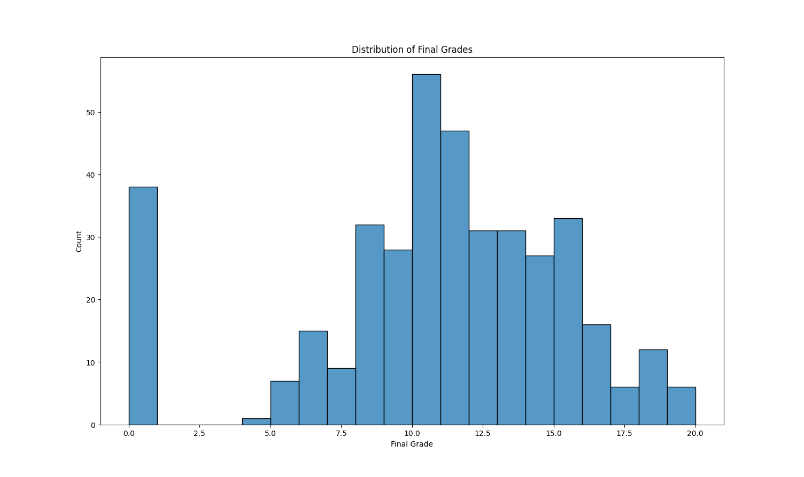
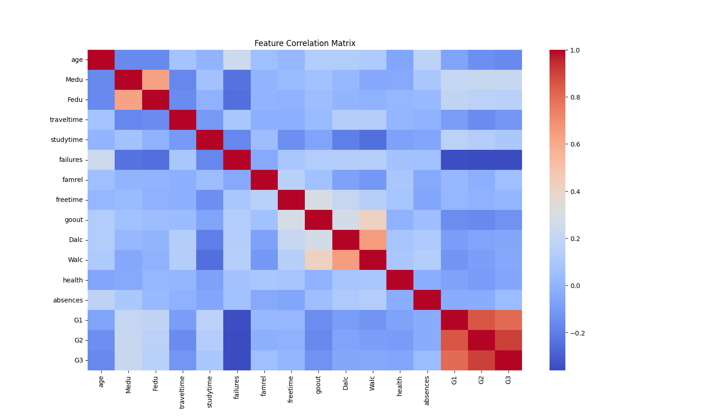
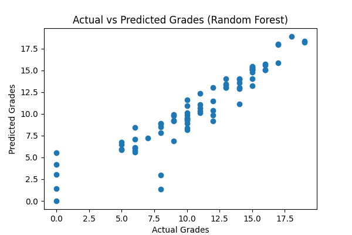
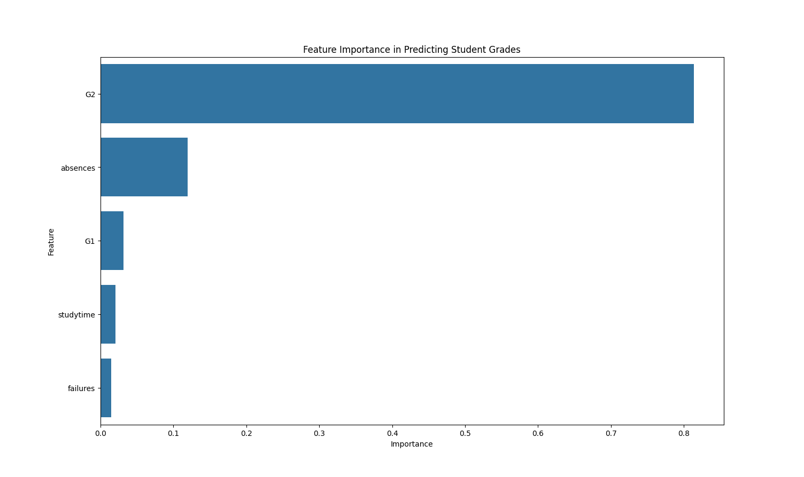

# Student Performance Prediction using Machine Learning

This project applies machine learning techniques to analyze and predict student academic performance based on study behavior and previous grades.

The project demonstrates a complete data science workflow including data exploration, visualization, model training, and evaluation.

---

## Project Overview

Student performance is influenced by multiple academic and behavioral factors. This project uses a dataset of secondary school students to identify relationships between variables such as study time, past grades, failures, and absences.

Machine learning models are trained to predict the final grade (G3) of students.

---

## Technologies Used

Python  
Pandas  
NumPy  
Matplotlib  
Seaborn  
Scikit-learn

---

## Dataset

The dataset used in this project contains academic and behavioral information about 395 secondary school students.

Key variables include:

- Study time
- Number of past class failures
- Absences
- First period grade (G1)
- Second period grade (G2)
- Final grade (G3)

Dataset source: Kaggle

---

## Machine Learning Models

Two regression models were used:

1. Linear Regression  
2. Random Forest Regressor

The models were trained and evaluated using an 80/20 train-test split.

---

## Results

The Random Forest model produced better predictive performance compared to Linear Regression, suggesting that non-linear relationships exist between study behavior and student performance.

Previous grades (G1 and G2) were the strongest predictors of final academic performance.

---

## Visualizations

### Grade Distribution

### Feature Correlation

### Actual vs Predicted Grades

### Feature Importance

---

## How to Run

1. Install required libraries

pip install -r requirements.txt

2. Run the script

python student_performance_prediction.py

---

## Project Author

Fasila Ansari  
BSc Computer Science
